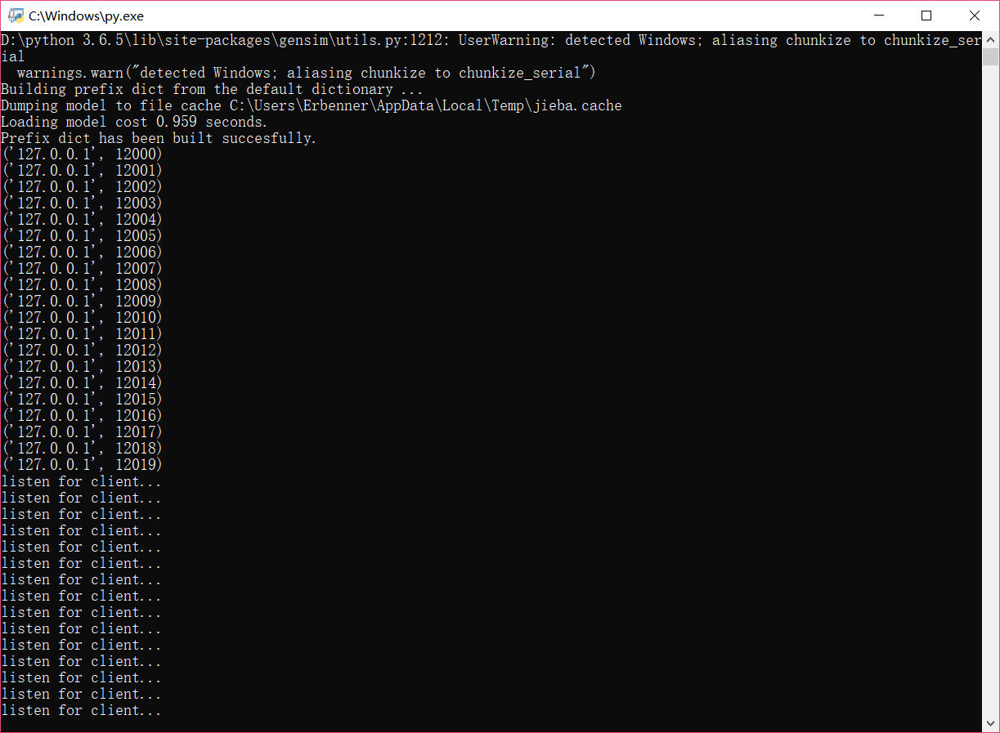
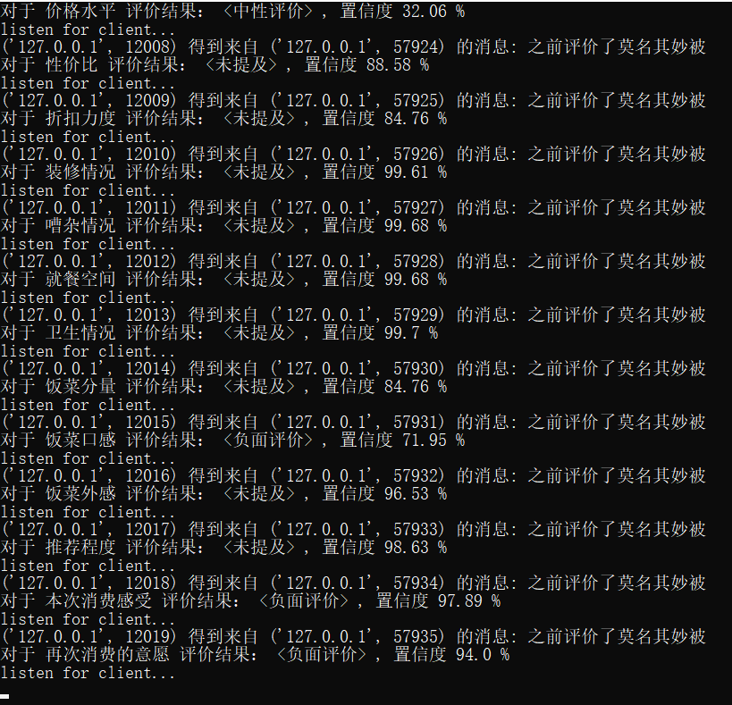
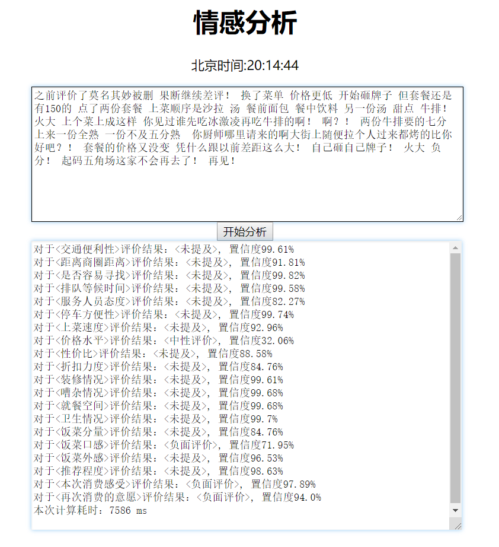
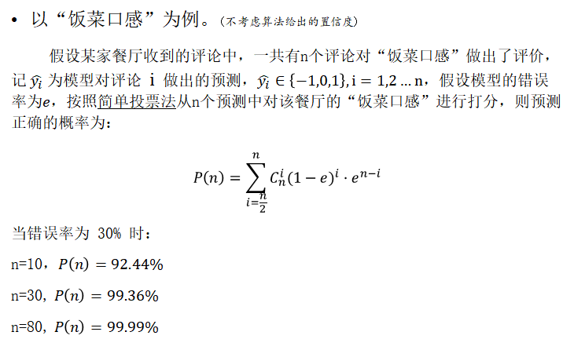

# 开启服务端进程，开始监听
运行/demo/src/load_server.py，打开socket端口，开始监听  
  
# 接收到分析请求，开始分析  
  
# 用户交互界面  
交互页面由jsp实现，参数传递方式为同步请求（还不会ajax异步请求...）。  
jsp文件在/demo/WebContent/目录下。  
  
# 性能评价
第一次分析的时候，会比较慢，大概一条评论十几秒左右。但是从第二次分析开始，耗时开始稳定在1200ms左右。  
图中显示7000+ms是因为截图的时候我电脑开了别的进程吃了点cpu。  
我的cpu是i5-4代，gpu是GTX 730M(1G)，所以速度比较慢，但是性能稍微好一点的机器，分析一条评论只需500ms（甚至更少）左右。  
时间大部分浪费在对输入文本的处理上，而每个模型的计算时间其实很少。  
如果是公司有这种业务的话，其实不需要这种交互页面，本模型更擅长处理对大批量的评论文本进行情感分析的任务，一个评论一个评论分析反而发挥不出其优势。  
**ps. 大众点评网站上大部分店铺的评论数量都在几百条或几千条左右，可以通过本模型轻易分析出某个店铺的优缺点。**  
**一方面可以帮助消费者快速了解一个陌生店铺的优点，另一方面也可以帮助店铺发现自己能改进的地方。**
# 可行性分析
  

**因此，虽然该模型在分析某一条特定评论时准确率或许只有70%左右，但是在针对一个特定店铺进行分析时，得到的结果已经足够好了。**  
  
[>>返回Readme](../README.md)
